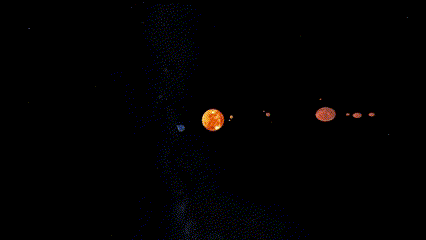
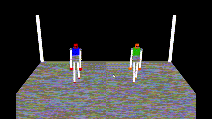

# Computação Gráfica com GLUT

## Introdução

Repositório criado para a turma de Computação gráfica, onde tinha era necessário a criação de dois projetos sendo o primeiro um Planetário e o segundo uma luta de robôs

## Planetário

## Luta de Robôs

# Instalação

- baixe esse arquivo [zip](https://drive.google.com/file/d/1pOTqjmjP5Zp8AbYus672kD5jM1KFhq16/view) e extraia ele para uma pasta

- Abra o local onde foi extraído e recorte a pasta "OpenGL Programming" para uma pasta no seu computador.

> [!NOTE]  
> Essa pasta vai ser onde você vai criar seus projetos, pode renomear ela se quiser.

- Abra o VSCode e abra essa pasta no VS Code.

- vá na aba "Extensões" do VS Code, e procure por "Run++"

- Pelo VS Code você pode apagar todos os arquivos .cpp

- deve ficar somente a pasta .vscode e os arquivos .txt

- para rodar os projetos, clique com o botão direito do mouse no arquivo a ser executado e clique em `run++` ou `Alt+B`

divirta-se
